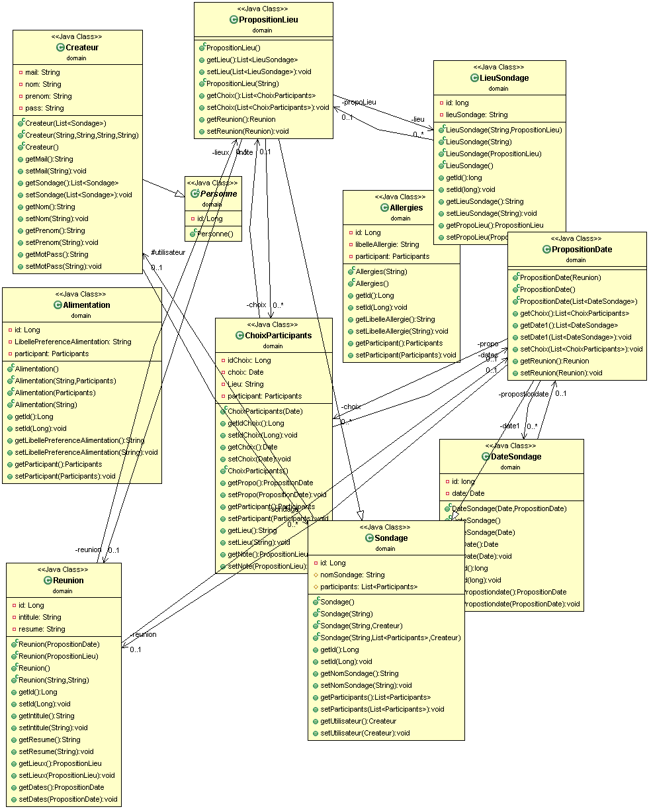

# Compte rendu de backend du projet Doodle
l'objectif du projet est de faire une application de prise de rendez vous de type Doodle.
D'abord ce application nous permet de creer un sondage par un ulisateur avec differents type de choix de date ou lieu.
Par la suite,les participants participe au sondage grace a leur mail.

## architecture du projet
cette partie du projet correspond au partie backend du projet. Elle est divisé en trois couche 
### couche JPA 
cette couche contient des classes java et ces classes java sont tronformés par la suite en Entité JPA, ses entités sont rendu persistant pour etre enregister dans la base de données
###  couche DAO
cette couche contient des classes dao qui permet de regrouper les accès aux données persistantes dans les classes objets. il permet 
d'abstraire la facon dont les données sont stockées au niveau des objets metiers. Ainsi le changement de mode de stockage ne remet pas en cause le reste de l'application
### Couche service 
cette couche permet definir les service notre API propose. nous avons utilisé l'APi JAX RS et le Framework Jersey qui permet de definir les service web selon l'architecture REST 

## Diagramme de classe de la partie JPA 

# licence du projet
The software developed is open source software.
# Installation
git clone https://github.com/issa7/tpjpa2019sir.git

## Pour eclipse 4.X
Depuis eclipse 4.X, le support de maven s’est amélioré. Pour importer votre projet. File -> import -> maven -> existing maven project.
Votre projet est configuré.

## Démarrage de la base de données
 Vous trouverez là le script de démarrage de la base de données (run-hsqldb-server.sh) et le script du démarrage du Manager (show-hsqldb.sh). Lancez le système de base de données, puis le Manager. Connectez vous à la base de données (login : sa – et pas de mot de passe : -- URL de connexion : jdbc:hsqldb:hsql://localhost/ ).
 
 ### mysql 
 mysql a été configurer dans le fichier persistence.xml 
 la base de données est dans le dossiers bd_mysql
 
 
 ## Executer le backend
 faire maven build en ligne de commande 
 sous eclipse faire run -> maven build ... et saisir tomcat7:run dans le formulaire goals qui s'affiche une fois cliquer sur maven build
 
 ## port du serveur tomcat 
 pour des raisons d'utilisation des ports 8080 bous avons configuer le port tomcat à :
 ### port du serveur backend : localhost:8083/
 
### Documentation Api
il existe des fichiers en json dans le dossier documentation Api, ces fichiers peuvent etre importées dans postman pour tester notre Api

# authors

### Issa KEITA
### Seydou BAKAYOKO

